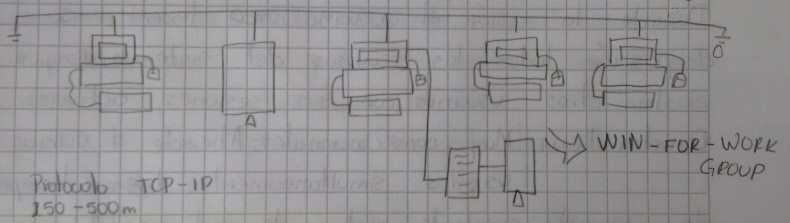

# Cuarta Generación: El Proceso Distribuido

## Proceso Distribuido (La Red)

+ __Interconector computadores:__
    - Backbone Distribuido (Cable Coaxial).
    - Backbone Colapsado (Cable UTP).
+ __Compartir recursos (C/S):__
    - Especializa procesos.
    - P. Clientes: Peticiones.
    - P. Servidor: Resuelve peticiones.
    - Filosofía de capas (F, E, R, T, S, P, A).
    - Comunicación a traves del Kernel.
    - Procesos corren en modo usuario.
    - Kernel corre en modo protegido.
    - Permite uso del recurso independiente de su ubicación física.
    - Intercambio de información.
+ __Mutiprocesamiento:__
    - Descomposición en subalgoritmos.
    - Resultados parciales se integran.
    - Procesamiento simétrico/asimétrico.
    - Clostering/Procesamiento paralelo
+ __Maquinas virtuales:__
    - Ocultan plataforma.
    - Ambiente para el usuario.
    - Las peticiones se resuelven via C.M.S (Conventional Monitor System).

## Funciones Y Programas Del S.O (Básicos)

### Funciones Del S.O
+ __Supervisor:__
    - Monitor.
    - Rutina Ejecutiva.
+ __Administrador de recursos:__
    - Recursos:
        * Procesador.
        * Memoria.
        * I/O.
        * Archivos.
    - Funciones:
        * Llevar registros del recurso.
        * Hacer cumplir política.
        * Asignar recursos.
        * Recuperar recursos.
+ __Generador de archivos:__
    - Bitacora de trabajos ejecutados (LOG).
    - Contabilidad/uso de recursos.
    - Update/upgrade.

### Programas Del S.O
+ Editor de texto.
+ Spool.
+ Básicos de comunicación.
+ Montadores enlazadores.
+ B.D.D.
+ Compiladores.
+ Librerías.
+ Interprete de comandos/programas de seguridad.

## Aspectos Internos Del S.O
+ Interrupción/llamado
+ Protección:
    - Memoria.
    - I/O.
    - CPU.
+ Operación dual
    - Usuario.
    - Protegido (Kernel).

## Tipos De S.O
+ Mono-Multi -> Programado.
+ Mono-Multi -> Usuario.
+ Mono-Multi -> Procesamiento.
+ Máquinas virtuales.
+ Sistemas propietarios.
+ Sistemas abiertos.

## Estructura del S.O
+ Monolitico
+ Por capas:
    - Interprete.
    - Archivos.
    - Disp I/O.
    - Memoria.
    - Procesos.
    - Hardware.
