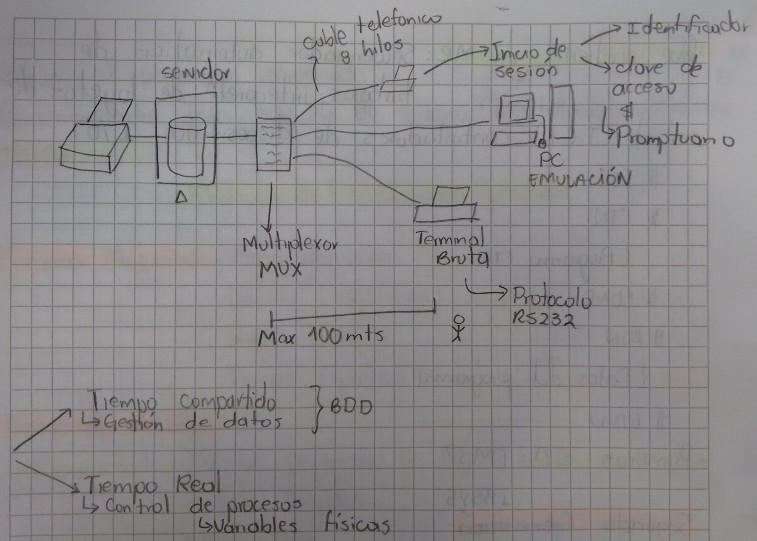
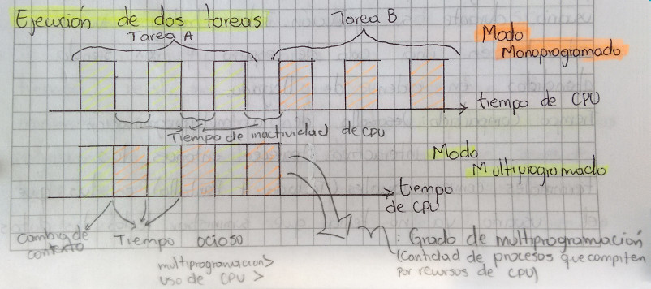

# Tercera Generación: La Multiprogramación

Es un modo de trabajo en el que se pueden ejecutar varios programas
simultáneamente con el fin de aprovechar al máximo los recursos del
computador. Surgió ante la imposibilidad de los sistemas anteriores de
ocupar durante todo el tiempo totalmente el procesador y los dispositivos
I/O. Existen dos tipos de trabajos que limitan la utilización de los
recursos del computador.

+ __Trabajos Limitados Por Proceso:__
  Aquellos que consumen la mayor parte del tiempo en el tratamiento de
  información y muy poco en operaciones de I/O.

+ __Trabajos Limitados Por Operaciones I/O:__
  Aquellos que dedican la mayor parte de su tiempo en operaciones de I/O
  haciendo poco uso del procesador, el cual se mantiene inactivo durante
  grandes periodos de tiempo.

En este ultimo tipo de trabajo el que precisamente de origen a la
multiprogramación que consiste en aprovechar la inactividad del procesador
durante la ejecución de una operación I/O de un proceso en atender a otro
proceso. Desde el puno de vista del usuario se considera que los procesos se
están realizando en paralelo, aunque en el momento solo se atiende a uno de
ellos.

## Ejecución De Dos Tareas

El sistema multiprogramado trae algunos problemas:
1. El acceso del procesador debe seguir un tipo de regla que permita la
   ejecución de todos los trabajos.
2. Se requiere una buena administración de las memoria, puesto que esta tiene
   que ser compartida por todos los trabajos.
3. Varios trabajos pueden necesitar simultáneamente de un recurso, dando lugar
   a problemas de concurrencia.  

Con el proceso de plantear el procesamiento se crea una estructura de __Nucleo
Central (Kernel)__ compuesta por rutinas para gestión de memoria central, el
procesador y los dispositivos I/O.  
Algunas aplicaciones de este tipo de administración son:
+ __Proceso en lotes (Batch):__
  Actividad en sistemas multiprogramados para ejecutar procesos largos que no
  requiere intervención del usuario durante su ejecución. Tales trabajos van
  entrando en una cola de espera y van siendo atendidos en orden de llegada.
+ __Tiempo compartido:__
  Desarrollo de la multiprogramación interactiva. Aparecen entonces las
  terminales conversacionales (teclado + pantalla) en las que en usuario ya no
  tenia que suministrar todos los datos al principio de la ejecución del
  proceso, si no suministrarlos al momento que el proceso los va necesitando.
  De igual manera ir recibiendo respuesta inmediata a sus datos.  
  En este momento de trabajo aparece el concepto de sesión. Durante estas
  sesiones pueden realizar multitud de operaciones controladas por un proceso
  (__Interprete De Comandos__) que mantiene el dialogo entre el usuario y el
  S.O durante la sesión el usuario cree tener a su disposición todos los
  recursos del computador aunque existen otros usuarios con sus sesiones
  activas.  
  __Características:__
    - Muy conversacionales.
    - Atienden a varios usuarios simultáneamente.
    - Buenos tiempos de respuesta.
    - Excelente gestión de archivos.
    - Utiliza técnicas de buffering y spooling.
    - Administra memoria virtual.
+ __Tiempo Real:__
  La tercera modalidad de los S.O multiprogramados son los sistemas de tiempo
  real, en los que se necesitan tiempos mínimos de respuesta ante cualquier
  petición.  
  Utilizados regularmente en sistemas de control con sensores donde
  se requiere una respuesta casi inmediata sobre el sistema a controlar
  (variables físicas). De ahí su nombre, trabajan en tiempo real por lo que
  permiten controlar y regular el medio sobre el que operan.  
  __Características:__
    - Respuestas en tiempos mínimos.
    - Información actualizada y permanente.
    - El sistema permanece inactivo presentado disponibilidad para atender
      eventos.
    - Manejo eficaz de interrupciones.
    - Manejo sencillo de prioridades.
    - Administra memoria real.
