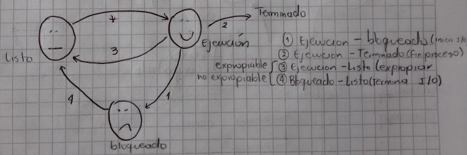

# Pasos En La Ejecución De Un Proceso

1. Se crea un archivo de programa normalmente llamado programa ejecutable.
2. A partir del archivo del programa se construye un trabajo (JOB) el cual va a
   presentar al usuario ante el sistema. El trabajo se ubica en la cola de
   trabajos.
3. El planificador (JOB-SCHEDULER) elige al trabajo para que entre al sistema,
   le asigna memoria, carga el programa correspondiente y construye un proceso,
   ubicando en la cola de procesos activos. __LISTO__.
4. El despachador le asigna el procesador. __LISTO-EJECUCIÓN__.
5. Durante su ejecución el programa requiere leer un dato. En este caso debe
   colocarse en la bola del dispositivo de memoria auxiliar, y esperar que este
   le sea asignado para leer archivo de datos. __EJECUCIÓN-BLOQUEADO__.
6. Una vez le ha sido asignado el dispositivo de la memoria auxiliar, se
   realiza la lectura virtual y el proceso es nuevamente ubicado en al cola de
   procesos activos. __BLOQUEADO-LISTO__.
7. El despachador le asigna procesador. __LISTO-EJECUCIÓN__.
8. Durante su ejecución el proceso requiere escribir un(os) dato(s). Para ello
   se sigue el procesamiento similar al de lectura. __EJECUCIÓN-BLOQUEO__.
9. Una vez le ha sido asignado el dispositivo de la memoria auxiliar, se
   realiza la impresión virtual y el proceso es ubicado en la cola de procesos
   activos. __BLOQUEADO-LISTO__.
10. El despachador le asigna procesador. __LISTO-EJECUCIÓN__.
11. El proceso finaliza su ejecución y es retirado de la cola de procesos
    activos. En una etapa posterior se realiza la impresión física de lo
    impreso virtualmente. __EJECUCIÓN-EXIT__.
