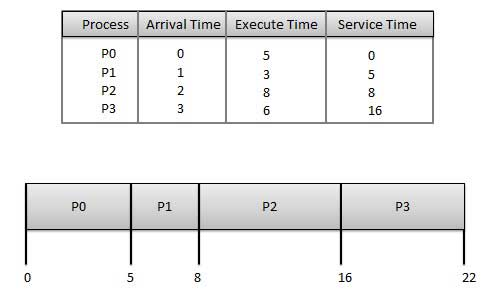
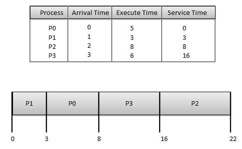
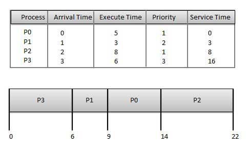
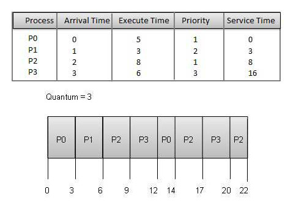

# El Despachador
Cuando hay más de un proceso que esa en condiciones de ejecutar en la CPU, se
debe escoger alguno. El encargado de tomar esta decisión es el despachador
(Planificador / Scheduler) y el algoritmo que usa se llama "El algoritmo de
despacho (planificación)".

## Posibles Objetivos (Algunos Contradictores) De Un Algoritmo De Despacho
1. __Justicia:__
   Asegurarse que todos los procesos tengan su turno en CPU.
2. __Eficiencia:__
   Mantener la CPU ocupada todo el tiempo.
3. __Tiempo de respuesta:__
   Minimizar el tiempo de respuesta de los usuarios inactivos.
4. __Rendimiento productividad:__
   (Troughput) Maximizar el numero de trabajos terminados por unidad de tiempo.
5. __Tiempo de espera:__
   Minimizar el tiempo medio de espera (en la cola ready) de los procesos.
   Tiempo transcurrido entre llegar y ser atendido.

Una complicación adicional que hay que tener en cuenta es que cada proceso es
único e impredecible. Algunos son intensivos en I/O  otros son intensivos en
CPU. En cualquier caso todos los proceso alternan entre una fase de ejecución
de CPU y la otra de espera por I/O. Aunque la duración de las fases de CPU, es
impredecible y varia mucho entre un proceso y otro, ¿que dice el siguiente
gráfico estadístico?; el cual puede ser muy importante a la hora de tomar una
decisión.

## ¿Cuando hay que planificar? ¿Cuando trabaja el algoritmo?

En los casos 1 y 2 necesariamente hay que escoger un nuevo proceso (CPU
desocupada), pero en los casos 3 y 4 podría no tomarse ninguna decisión de
Scheduling. ¿Por que?

¿Problemas de planificación expropiadora? Suponga dos procesos que comparten un
recurso. En el momento en el que uno de los procesos esta modificando el
recurso compartido le quitamos CPU y no alcanza a modificar. El otro proceso
encontraría una variable mal actualizada.

## Algoritmos De Despacho

+ No expropiadores: FCFS, SJF
+ Expropiadores: Basado En Prioridad, Round Robin

### First Come, First Serve (FCFS)
+ Los trabajos son ejecutados a medida que llegan. El primero que llega el
  el primero en ser atendido.
+ Fácil de entender e implementar.
+ Bajo en rendimiento ya que el tiempo promedio de espera es muy alto.

__Ejemplo:__

El tiempo de espera de cada proceso es el siguiente:

| Proceso | TiempoServicio - TiempoLlegada = TiempoEspera |
|---------|-----------------------------------------------|
| P0      | 0 - 0 = 0                                     |
| P1      | 5 - 1 = 4                                     |
| P2      | 8 - 2 = 6                                     |
| P3      | 16 - 3 = 13                                   |

Tiempo promedio de espera: (0+4+6+13) / 4 = 5.55

### Shortest Job First (SJF)
+ El mejor algoritmo para mejorar el rendimiento.
+ Imposible implementar.
+ El procesador debe saber con anterioridad cuanto tiempo los procesos se van a
  demorar.

__Ejemplo:__

El tiempo de espera de cada proceso es el siguiente:

| Proceso | TiempoServicio - TiempoLlegada = TiempoEspera |
|---------|-----------------------------------------------|
| P0      | 3 - 0 = 3                                     |
| P1      | 0 - 0 = 0                                     |
| P2      | 16 - 2 = 14                                   |
| P3      | 8 - 3 = 5                                     |

Tiempo promedio de espera: (3+0+14+5) / 4 = 5.50

### Basado En Prioridad
+ Cada proceso se le es asignada una prioridad. Los procesos son ejecutados del
  mayor a menor prioridad.
+ Si dos procesos tiene igual prioridad el que llega primero es el primero en
  ser atendido.
+ La prioridad puede ser decidida basada en cuanta memoria, tiempo de ejecución,
  o requerimiento de recursos necesita el programa.

__Ejemplo:__

El tiempo de espera de cada proceso es el siguiente:

| Proceso | TiempoServicio - TiempoLlegada = TiempoEspera |
|---------|-----------------------------------------------|
| P0      | 9 - 0 = 9                                     |
| P1      | 6 - 1 = 5                                     |
| P2      | 14 - 2 = 12                                   |
| P3      | 0 - 0 = 0                                     |

Tiempo promedio de espera: (9+5+12+0) / 4 = 6.5

### Round Robin
+ Cada proceso se le es dado un tiempo fijo de ejecución llamado Quantum.
+ Una vez que un proceso es ejecutado por cierto tiempo (Quantum). El proceso
  es precedido, y otro proceso es ejecutado por el mismo tiempo.
+ El cambio de contexto es usado para guardar los estados de los procesos
  precedidos.

__Ejemplo:__

El tiempo de espera de cada proceso es el siguiente:

| Proceso | TiempoServicio - TiempoLlegada = TiempoEspera |
|---------|-----------------------------------------------|
| P0      | (0 - 0) + (12 - 3) = 9                        |
| P1      | (3 - 1) = 2                                   |
| P2      | (6 - 2) + (14 - 9) + (20 - 17) = 12           |
| P3      | (9 - 3) + (17 - 12) = 11                      |

Tiempo promedio de espera: (9+2+12+11) / 4 = 8.5
