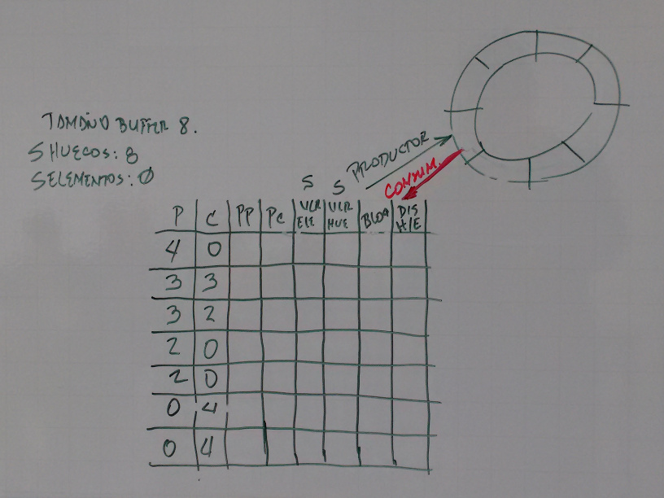

# Sincronización De Procesos
Muchos problemas se pueden resolver más fácilmente o más eficientemente si
usamos procesos (o hilos) cooperativos, que ejecutan concurrentemente, técnica
que se conoce como programación concurrente. La programación concurrente es una
herramienta poderosa, pero introduce algunos problemas que no existen en la
programación secuencial no concurrente.  
Supongamos que usamos dos hilos concurrentes para determinar cuantos números
primos hay en in intervalo dado.

```c
int numprimos = 0;
void primos(int ini, int fin) {
    for (int i = ini; i <= fin; i++)
        if (primo(i)) numprimos++;
}
```

Siendo `numprimos` una variable global, podemos ejecutar `primos(1, 5000)` en
paralelo con `primos(5001, 10000)` para saber cuantos números primos hay entre
1 y 10000. ¿El problema? `numprimos` es una variable compartida que se accesa
concurrentemente y puede quedar mal actualizada si se dan determinadas
intercalaciones de las operaciones de los dos hilos. Para ejecutar una
operación como `numerosprimos++` se suelen requerir varias instrucciones de
máquina como por ejemplo.

```
LOAD numprimos ; cargar el valor en el acumulador
ADD numprimos, 1 ; sumarle 1 al acumulador
STORE numprimos ; escribir el acumulador en memoria
```

Supongamos que más o menos simultáneamente, los dos hilos encuentran su primer
número primo. Podría darse el siguiente timing.


El problema se produce por que los dos hilos o procesos tratan de actualizar
una variable compartida al mismo tiempo, o en otras palabras, un hilo comienza
a actualizar cuando la otra no ha terminado. Eso se conoce como competencia por
datos (data race / race condition), cuando el resultado depende del orden
particular en que se intercalan las operaciones de procesos concurrentes. La
cosa se resuelve si garantizamos que solo un hilo a la vez puede estar
actualizando variable compartidas.

## El Problema De La Sección Crítica
Modelo: n procesos (P0, P1, P2, ... Pn-1) cada uno de los cuales tiene un trozo
de código llamado SECCIÓN CRÍTICA, en el que accesa variables o en general
recursos compartidos. El problema de la sección crítica consiste en encontrar un
mecanismo o protocolo que permita que los procesos cooperen de manera que se
cumpla las siguientes condiciones:

+ __Exclusión Mutua:__ La ejecución de las respectivas secciones críticas es
  mutuamente exclusiva, es decir nunca hay más de un procesos ejecutando su
  sección crítica.
+ __Ausencia de Postergación Innecesaria:__ Si un procesos quiere entrar en su
  sección crítica entonces podría hacerlo si todos los demás procesos están
  ejecutando sus secciones no críticas.
+ __Entrada Garantizada (Ausencia de inanición):__ Si un proceso quiere entrar
  a la sección crítica entonces (algún día) entrará.

Podemos pensar que el proceso se ejecuta:

```c
while (true) {
    // Protocolo de entrada
        // Sección critica
    // Protocolo de salida
        // Sección no critica
}
```

Vamos a suponer que:

+ Todos los procesos tienen oportunidad de ejecutar.
+ Todo proceso que comienza a ejecutarse su sección crítica, ejecutará en algún
  momento el protocolo de salida.
+ Las instrucciones básicas de lenguaje de máquina `LOAD, STORE, TEST`, se
  ejecutan de forma atómica.

No debemos hacer ninguna suposición respecto de la velocidad relativa de
ejecución de un proceso con respecto a otro. Por ahora vamos a restringir el
análisis al caso de dos procesos.

+ __PRIMER INTENTO:__ Deshabilitar interrupciones.
```c
while (true) {
    // Deshabilitar interrupciones
        // Sección critica
    // Habilitar interrupciones
        // Sección no critica
}
```
  El problema es dar ese poder a un proceso.
+ __SEGUNDO INTENTO:__ Compartir una variable turno que indique quien puede
  entrar a la sección crítica.
```c 
while (true) {
    while (turno != 0) { // Protocolo de entrada, espero si no es mi turno
        // Sección critica
    }
    turno = 1 // Cambio de turno
    // Sección no critica
}
```
  El problema es la Alternación estricta, incumple con la Ausencia de
  Postergación Innecesaria
+ __TERCER INTENTO:__

+ __CUARTO INTENTO:__

## Semáforos
Un semáforo es un mecanismo de sincronización que se utiliza generalmente en
sistemas con memoria compartida bien sea monoprocesador o multiprocesador. Un
semáforo es un objeto con valor entero al que se puede asignar un valor inicial
no negativo y al que solo se puede acceder utilizando dos operaciones atómicas
`wait` y `signal`. Las definiciones de estas operaciones son las siguientes.

```c
int wait(int s) {
    s = s - 1;
    if (s < 0) {
        // Bloquear proceso
    }
    return 0;
}

int signal(int s) {
    s = s + 1;
    if (s <= 0) {
        // Desbloquear un proceso bloqueado en la operación wait
    }
    return 0;
}
```

Cuando el valor del semáforo es negativo, cualquier operación `wait` que se
realice sobre el semáforo bloqueará el proceso. Cuando el valor del semáforo es
positivo, cualquier proceso que ejecute una operación `wait`, no se bloqueará.  
El numero de procesos que en un instante determinado se encuentran bloqueados en
una operación `wait` viene dado por el valor absoluto del semáforo, si es
negativo.  
Cuando un proceso ejecuta la operación `signal`, el valor del semáforo se
incrementa, en le caso que haya algún proceso bloqueado en una operación `wait`
anterior, se desbloqueara a un solo proceso.

### Solución Del Problema De Sección Critica Para Tres Procesos
Para resolver el problema de la sección crítica, utilizando semáforos debemos
proteger el código que constituye la sección critica de la siguiente forma:

```c
int wait(int s) {
    // Sección crítica
}

int signal(int s) {
    // Sección no crítica
}
```

El valor que debe tomar el semáforo inicialmente es 1, de esta forma solo se
permite a un único proceso acceder a la sección crítica.  
Si el valor inicial del semáforo fuera por ejemplo 2, entonces dos procesos
podrían ejecutar la llamada `wait` y por lo tanto se permitiría que ambos
ejecuten de forma simultanea dentro de la sección crítica. En la siguiente
figura se muestra la solución de este problema para tres procesos. En la
siguiente figura se muestra la solución de este problema para tres procesos que
tienen que acceder a su sección crítica. Los tres procesos se sincronizan
utilizando un semáforo con valor inicial.  


## El Problema Productor / Consumidor
Dos procesos que comparten un buffer limitado o circular. En el uso del buffer
compartido el proceso productor fabrica un determinado dato y lo inserta en el
buffer. El proceso consumidor retira del buffer los elementos insertados por el
productor. En este tipo de problemas es necesario evitar que ocurra alguna de
las siguientes situaciones.
+ El consumidor saca elementos cuando el buffer esta vació.
+ El productor coloca elementos en el buffer cuando este se encuentra lleno.
+ El productor sobrescribe un elemento que todavía no ha sido sacado del buffer.
+ El consumidor saca elementos del buffer que ya fueron sacados con
  anterioridad.
+ El consumidor saca un elemento mientras el productor lo está insertando.



```c
int productor() {
    int posicion = 0;
    while (true) {
        producir_un_dato;
        wait(huecos);  // Decrementa huecos
        buffer[posicion] = dato;  // Se inserta en el buffer
        posicion = (posicion + 1) % BUFFER_SIZE;
        signal(elementos);  // Incrementa elementos
    }
    return 0;
}

int consumidor() {
    int posicion = 0;
    while (true) {
        producir_un_dato;
        wait(elementos);  // Decrementa elementos
        dato = buffer[posicion];  // Extrae del buffer
        posicion = (posicion + 1) % BUFFER_SIZE;
        signal(huecos);  // Incrementa huecos
        // Consumir dato extraído
    }
    return 0;
}
```

El semáforo `huecos` representa el numero de ranuras libres que hay en el buffer
y el semáforo `elementos` el número de elementos introducidos en el buffer por
el productor que aun no han sido retirados por el consumidor.  
Cuando el productor desea introducir un nuevo elemento en el buffer decrementa
el valor del semáforo `huecos` (operación `wait`). Si el valor se hace negativo,
el proceso se bloquea ya que no hay nuevos huecos donde insertar elementos.
Cuando el productor ha insertado un nuevo dato en el buffer incrementa el valor
del semáforo `elementos` (operación `signal`). Por su parte el proceso
consumidor antes de eliminar del buffer un elemento decrementa el valor del
semáforo `elementos` (operación `wait`). Si el valor se hace negativo, el
proceso se bloquea. Cuando elimina del buffer un elemento incrementa el valor
del semáforo `huecos` (operación `signal`). La correcta sincronización entre los
dos procesos queda asegurada puesto que cuando el proceso consumidor en la
operación `wait` sobre el semáforo `elementos` se despertará cuando el proceso
productor inserte un nuevo elemento en el buffer e incremente el valor de dicho
semáforo con la operación `signal`. De igual manera cuando el proceso productor
se bloquea por que el buffer esta vacío se despertará cuando el proceso
consumidor extraiga un elemento e incremente el valor del semáforo `huecos`.

## El Problema Lectores / Escritores

```c
int lector() {
    n_lectores++;
    if (n_lectores == 1) {
        wait(sem_recurso);
    }
    signal(sem_lectura);
    // Consultar recurso compartido
    wait(sem_lectura);
    n_lectores--;
    if (n_lectores == 0) {
        signal(sem_recurso);
    }
    signal(sem_lectores)
}

int escritor() {
    wait(sem_recurso);
    // Se puede modificar el recurso
    signal(sem_recurso);
}
```

En esta solución, el semáforo `sem_recurso` se utiliza para asegurar la
exclusión mutua en el acceso al dato a compartir. Su valor inicial debe ser 1,
de esta manera en cuanto un escritor consigue decrementar su valor puede
modificar el dato y evitar que ningún otro proceso, ni lector ni escritor acceda
al recurso compartido.  
La variable `n_lectores` se utiliza para representar el número de procesos
lectores que se encuentran accediendo de forma simultánea al recurso compartido.
A esta variable acceden los procesos lectores en exclusión mutua utilizando el
semáforo `sem_lectores`. El valor de este semáforo, como el del cualquier otro
que se quiera emplear para acceder en exclusión mutua a un fragmento de código
debe ser 1. De esta forma se consigue que sólo un proceso lector modifique el
valor de la variable `n_lectores`.  
El primer proceso lector será el encargado de solicitar el acceso al recurso
compartido decrementando el valor del semáforo `sem_recurso` mediante la
operación `wait`. El resto de procesos lectores que quieran acceder mientras
esté el primero podrán hacerlo sin necesidad de solicitar el acceso al recurso
compartido. Cuando el ultimo proceso lector abandona la sección de código que
permite acceder al recurso compartido `n_lectores` se hace 0. En este caso
deberá incrementar el valor del semáforo `sem_recurso` para permitir que
cualquier proceso escritor pueda acceder para modificar el recurso compartido.  
Esta solución, tal y como se ha descrito, permite resolver el problema de los
lectores/escritores pero concede prioridad a los procesos lectores. Siempre que
haya un proceso lector, consultando el valor del recurso, cualquier proceso
lector podrá acceder sin necesidad de solicitar el acceso. Sin embargo, los
procesos escritores deberán esperar hasta que haya abandonado la consulta el
ultimo lector. Existen soluciones que permiten dar prioridad a los escritores,
soluciones que se dejan al lector.
