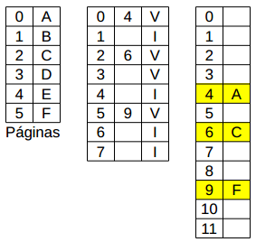
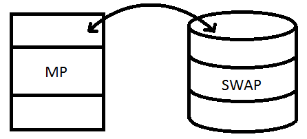
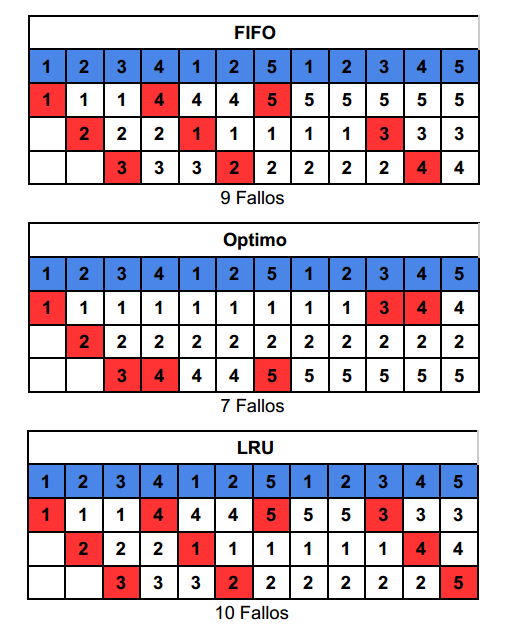

# Memoria Virtual
Cando hablamos de extender la memoria de manera virtual estamos hablando de
hacer que el proceso tenga la ilusión de que la memoria es mucho mas grande
que la memoria física (ó que el trozo de memoria física que le corresponde en
el caso de multiprogramación). El sistema operativo se encarga de mantener en
memoria los trozos (páginas) que el proceso esta usando y el resto en el disco.
Puesto que el disco es barato podemos tener espacio de direccionamiento
ilimitado (enorme).

## Paginación Por Demanda
Memoria virtual se implementa con un poco de ayuda del hardware, agregamos un
bit a la tabla de páginas que indica si la paginación en cuestión es: Valida
(cargada en memoria) o Invalida (no cargada en memoria).

El acceso a las páginas válidas funciona igual que antes, pero si la CPU intenta
accesar a una página invalida se produce una FALTA DE PAGINA que genera un TROP
al SO que debe encargarse de buscar esa  página en disco, ponerla en la memoria
y reanudar el proceso. En detalle el SO hace:
+ Bloquear el proceso.
+ Buscar la pagina en disco para subirla a memoria.
    - Hay un marco libre. SI NO HAY, GENERARLO
    - Ordenar al controlador la lectura / escritura.
    - Cargar en memoria.
+ Reanudar el proceso (listo).

Que hemos ganado:
+ No se requiere superposiciones para ejecutar programas grandes.
+ Solo cargamos las partes del programa que se usan. Reduciendo cestos de
  lectura en el disco.
+ Podemos aumentar la multiprogramación?
+ Un proceso puede ser mayor que la memoria?
+ Permite transferencia de información entre memoria principal y secundaria.

__Primera Regla:__ Tamaño SWAP => Tamaño RAM  
El tamaño depende de:
+ Tamaño de la RAM.
+ Cantidad de usuarios.
+ Cantidad de aplicativos.

## Algoritmo De Remplazo De Páginas

